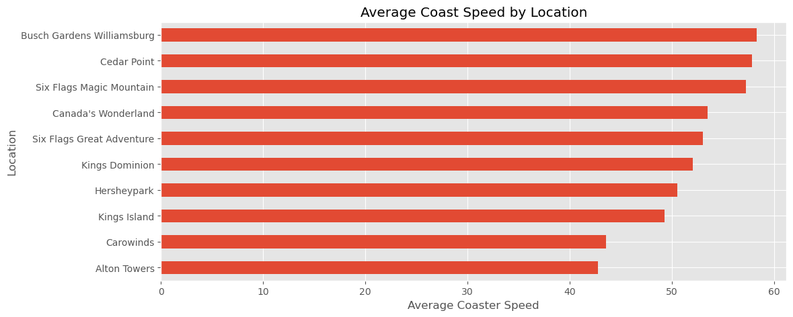

# 🎢 Roller Coaster EDA  

This project is an **Exploratory Data Analysis (EDA)** of a Roller Coaster dataset.  
The aim was to practice data exploration, ask meaningful questions, and answer them using **statistics and visualizations**.  

---

## 📌 Project Overview  

In this notebook, I explored the dataset to understand roller coaster characteristics such as **speed, height, and location**.  

Some of the questions I answered include:  
- 📍 Which locations have the **fastest roller coasters** (with at least 10 coasters)?  
- 🎡 How many roller coasters exist in each location?  
- 🚀 Which coasters are the **tallest and fastest** overall?  
- 📊 What trends can we observe across parks and countries?  

This project was my **first step into data science EDA**, building a foundation for deeper analysis and machine learning projects later.  

---

## 🛠️ Tools & Libraries  

- **Python 3**  
- [Pandas](https://pandas.pydata.org/) → data wrangling  
- [Matplotlib](https://matplotlib.org/) → visualizations  
- [Seaborn](https://seaborn.pydata.org/) → statistical plotting  
- [Jupyter Notebook](https://jupyter.org/)  

---

## 📊 Sample Visualization  

### Average Roller Coaster Speed by Location (min. 10 coasters)  

  

From this chart we see that:  
- **Cedar Point** and **Busch Gardens Williamsburg** have the fastest coasters on average.  
- **Alton Towers** and **Carowinds** are slower in comparison.  

----
